# Movie Recommender Case Study

By Jasmine He, Jane Stout, Ryan Holway, Scott Wigle, Emily Quigley

# Introduction

We worked with a set of dataframes relating to 5-star rating and free-text tagging activity from [MovieLens](http://movielens.org), a movie recommendation service. Collectively, the four dataframes contained the following 100,004 unique movie **ratings** and 1296 **tag applications** across 9125 movies. Ratings and tags were created by 671 users between January 09, 1995 and October 16, 2016. The dataframes were was generated on October 17, 2016. Users were selected at random; all selected users had rated at least 20 movies.

# EDA

<!-- # Basic Recommendation System -->

There was variability in the degree to which people rated movies; some people provided far more reviews than others. Figure 1 shows shows a visualizualization of the frequency with which different people rated movies. Names were randomly generated and used in place of userIDs.

**Figure 1. Word Cloud Representing the Frequency with which Different Users Provided Reviews**

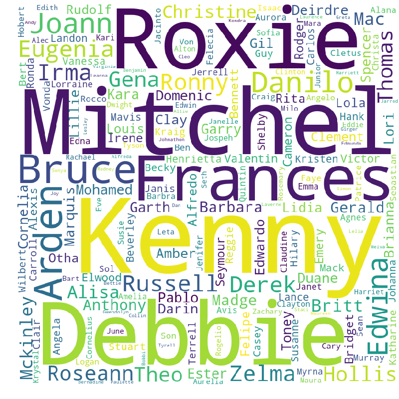

There is also variability in the film genres that recieved ratings. See Figure 2, which shows drama and comedy were the most frequently occuring genres.

Genres were were listed as a blend of multiple genres as shown here:

 *'Action|Adventure|Comedy|Fantasy|Romance'*

For the purpose of this visualization, genres were counted individually each time they were mentioned. No blended genres are included.

**Figure 2. Frequency of Genres**
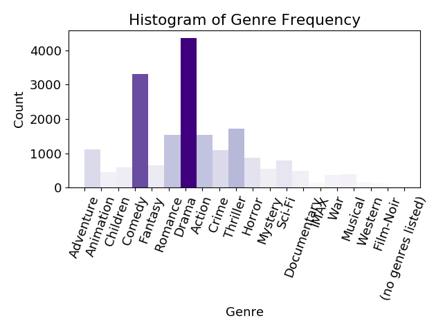

Finally, we found variability in ratings (see Figure 3), such that people tended to rate films over positively, overall.

**Figure 3. Frequency of Ratings**

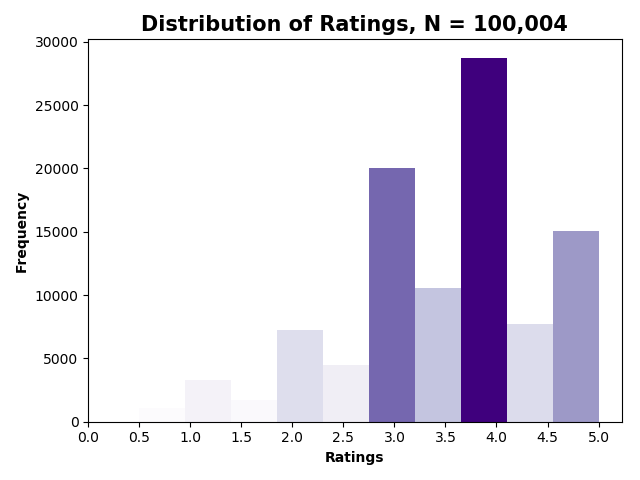

### Most Rated Movies
**Table 1. Top 10 Rated Movies**

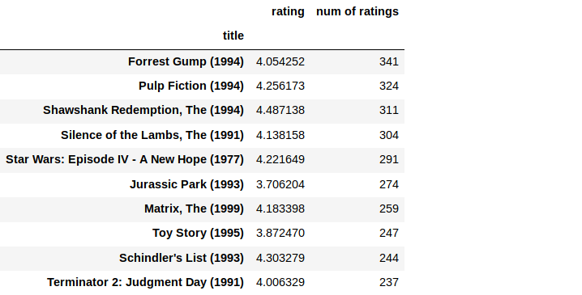

### What Movies Most Correlated to *Forrest Gump*
We sort the dataframe by correlation, we should get the most similar movies, however note that we get some results that don't really make sense.
This is because there are a lot of movies only watched once by users who also watched forrest gump (one of the most popular movie).

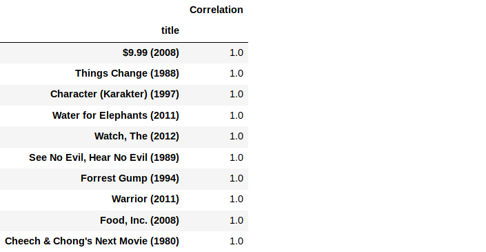

Then we fix this by filtering out movies that have less than 100 reviews.

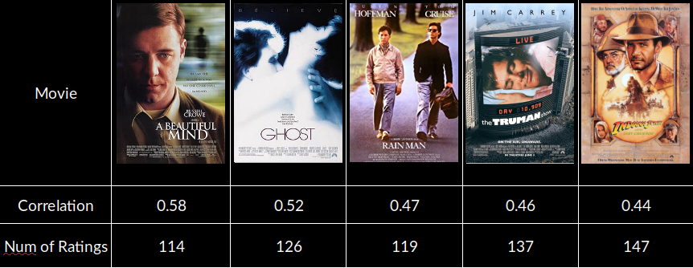

### What Movies Most Correlated to *The Silence of the Lambs*

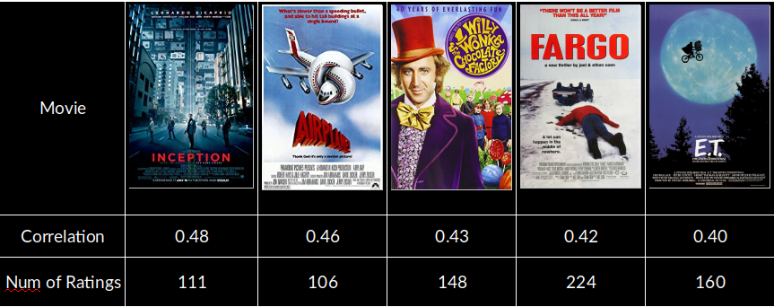

# Advanced Recommendation Systems

### Recommender Modeling

Our basic recommendation system can tell you what movies are most similar to your movie choice.

- Number of Users: 671
- Number of Movies: 9064

<!-- First we create a userId-movieTitle matrix, where each cell contained a rating that the user gave to a particular movie. Note there will be a lot of NaN values, because most people have not rated most of the movies. -->

Two most common types of recommendation systems are Content-Based and Collaborative Filtering (CF).

### Collaborative Filtering

- Memory-based models are based on similarity between items or users, where we use cosine-similarity.
- Model-based model is based on matrix factorization where we use SVD to factorize the matrix.

#### Model Strategy 1: Memory-Based Collaborative Filtering - Cosine Similarity
- User-Item Collaborative Filtering: “Users who are similar to you also liked …”
- Item-Item Collaborative Filtering: “Users who liked this item also liked …”

A distance metric commonly used in recommendation systems is cosine similarity, where the ratings are seen as vectors in n-dimensional space and the similarity is calculated based on the angle between these vectors.

#### Step 1: Create the user-item matrices for both testing and training data.
#### Step 2: Use the pairwise_distances function from sklearn to calculate the cosine similarity.
Cosine similarity for users k and a can be calculated using the formula below, where you take dot product of the user vector uk and the user vector ua and divide it by multiplication of the Euclidean lengths of the vectors.
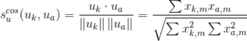

#### Step 3: Make predictions by applying the following formulas:
##### User-based CF
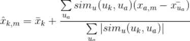

We can look at the similarity between users k and a as weights that are multiplied by the ratings of a similar user a (corrected for the average rating of that user). You will need to normalize it so that the ratings stay between 1 and 5 and, as a final step, sum the average ratings for the user that you are trying to predict.

##### Item-based CF
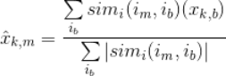

When making a prediction for item-based CF we don't need to correct for users average rating since query user itself is used to do predictions.

#### Step 4: Use RMSE to evaluate accuracy of the predicted ratings.

Memory-based algorithms are easy to implement and produce reasonable prediction quality. The drawback of memory-based CF is that it doesn't scale to real-world scenarios and doesn't address the well-known cold-start problem, that is when new user or new item enters the system.

#### Model Strategy 2: Model-Based Collaborative Filtering - Mean to Mean Versus NMF

Model-based Collaborative Filtering is based on matrix factorization which has received greater exposure, mainly as an unsupervised learning method for latent variable decomposition and dimensionality reduction. Matrix factorization is widely used for recommender systems where it can deal better with scalability and sparsity than Memory-based CF.

See Table 2 for RMSE for the Mean to Mean (benchmark) and NMF model.

**Table 2. Model RMSE values**

|      | Mean to Mean | NMF | % decrease |
|------|--------------|-----|------------|
| RMSE | 1.02         | .95 | 7%         |

<!-- ##### SVD
Collaborative Filtering can be formulated by approximating a matrix X by using singular value decomposition.
The general equation can be expressed as follows:

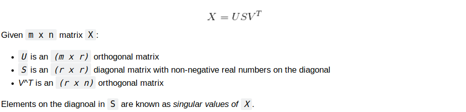

Elements on the diagonal in S are known as singular values of X.

Matrix X can be factorized to U, S and V. The U matrix represents the feature vectors corresponding to the users in the hidden feature space and the V matrix represents the feature vectors corresponding to the items in the hidden feature space.

User-based CF RMSE: 3.09
- SVD can be very slow and computationally expensive.
- Apply stochastic gradient descent to reduce RMSE.
- Use regularization terms to prevent overfitting. -->

##### NMF

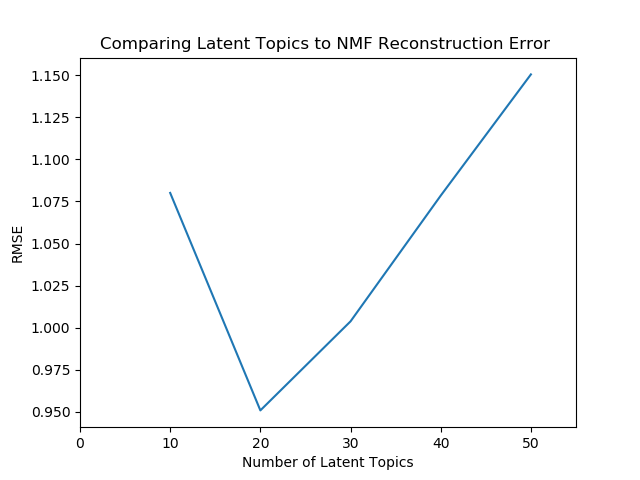

## Next Steps

- Generate recommendations, based on our NMF model
- Run our model on Spark
- Use regularization to prevent overfitting
